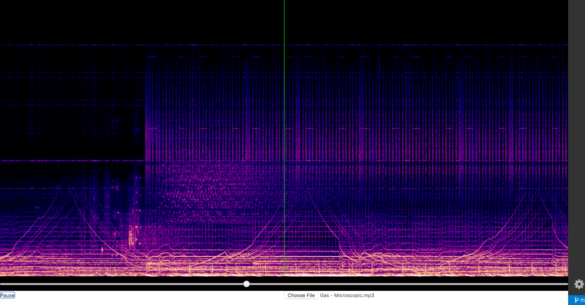

# WebAudio experiments

Lets try make some audio editor on WebAudio n React, shall we?

Due to usage of OfflineAudioContext and suspend/resume on them, the app can be run reliably on Chrome 55+ only, with Opera 42+ and Edge 12 untested. **Won't work on Firefox.**

Screenshot:

This project was bootstrapped with [Create React App](https://github.com/facebook/create-react-app).
